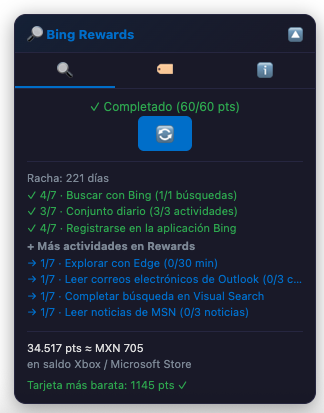

# Bing Rewards Auto Search

Tampermonkey userscript that automates daily Bing searches to collect Microsoft Rewards points. / Userscript de Tampermonkey que automatiza búsquedas diarias en Bing para acumular puntos de Microsoft Rewards.

> [!WARNING]
> **USE AT YOUR OWN RISK / USO BAJO TU PROPIO RIESGO:** automating activity may violate the Microsoft Rewards terms and put your account at risk. / Automatizar la actividad puede infringir los términos de Microsoft Rewards y poner tu cuenta en riesgo.

*Search tab: the day's progress in points as Rewards counts it, the controls for the current state, the day's tasks — your streak, each check-in partner with its step, and the daily set with a link to every activity still pending — and what your points are worth. / Pestaña de búsqueda: el progreso del día en puntos, tal como los cuenta Rewards, los controles según el estado, las tareas del día —tu racha, cada socio del check-in con su paso, y el conjunto diario con enlace a cada actividad que falte— y cuánto valen tus puntos.*

*Keywords tab: every keyword as a chip you can click to delete, plus bulk edit and reset to defaults. Below, *Use my Rewards progress* — the switch that decides whether Rewards works out how many searches are left, or the manual count below it does. / Pestaña de palabras clave: cada palabra como una etiqueta que se borra con un clic, más edición masiva y restaurar predeterminadas. Debajo, *Usar mi progreso de Rewards* —el interruptor que decide si es Rewards quien calcula cuántas búsquedas faltan, o el número manual de abajo—.*

*Info tab: it opens with the script's own language selector, and below it — cropped out here — come what the script does, how it works, and the privacy terms, including exactly which request it makes to Bing and how to turn it off. / Pestaña de información: arranca con el selector de idioma del propio script y, debajo —fuera de la captura—, qué hace, cómo funciona y los términos de privacidad, incluida la petición exacta que hace a Bing y cómo desactivarla.*

## English

### What it does

**Searching**
- Runs your daily Bing searches automatically so you can collect the Microsoft Rewards search points without doing them one by one.
- **It works out how many are left, so you don't have to.** With *Use my Rewards progress* on, the script asks Bing how many search points you are still missing today, runs only those, and stops on its own once Rewards marks the day complete.
- **It does not trust its own arithmetic.** The "searches left" figure is an estimate: Rewards counts in points, not searches, and several markets do not credit the first searches of the day, so the estimate runs low. The decision to stop therefore comes from Rewards' own *complete* flag, never from the estimate.
- **Late crediting does not end the run.** If several searches in a row go by without the Rewards counter moving, it is almost always latency — the points arrive, just late. So the script waits half a minute, re-reads your progress without spending a search, and carries on until the day is complete, however many searches that takes. The panel says so while it waits, and ⏹ is always there if you would rather stop. Behind all of it there is an absolute daily cap, as a last resort.
- **The manual number is the fallback:** 1 to 100, set with the ⚙ button (20 by default). It takes over whenever there is no Rewards session, and it is the only thing that counts if you clear the checkbox.
- **Start, continue, stop and restart.** The controls change with the state: a paused run offers *continue* and *restart*, a finished one only *restart*.
- **Progress survives reloads.** Each search is a real navigation, so the counter lives in storage rather than in the page — closing the tab or navigating away does not lose your place.
- **The counter resets on its own each day at midnight,** which is when Rewards resets too.

**The rest of the day, not just the searches**
- Under the controls the panel lists **what Rewards is asking of you today besides searching** — your global streak in days, and one line per check-in partner with the step it is on (search with Bing, the daily set, the Bing app check-in, exploring with Edge, Outlook, MSN…).
- **Each pending one is a link**, so it is one click away instead of a hunt through the dashboard. The daily set also opens out into its three activities, each with its own link. Open one while a run is going and the run stops itself, so it does not navigate you away before you have finished.
- The labels and their counts are **Bing's own**, taken from the same response, so a partner that only exists in your market shows up by itself — with the wording Rewards uses there.
- **A note closes the list**: the Rewards dashboard and the Bing app carry extra activities that change daily and are worth more points than these. The script does not do them for you; it points at where they live.

**What your points are worth**
- The panel shows your Rewards balance, what it converts to in Xbox / Microsoft Store credit, and the cheapest Xbox card together with how many points you still need for it.
- **The rate comes from Rewards, not from guesswork.** Where your market offers a variable-amount redemption, its official points-to-currency ratio is read straight from the catalogue. Only where that does not exist is the rate inferred from card prices, and the tooltip says as much.
- **Careful with the cheap cards:** within a single market the same card sells at different rates, and the small ones are the worst deal — in Mexico a MXN 20 card costs 57.25 points per peso while a MXN 100 one costs 48.95. That is why the cheapest card is used as the "you can redeem now" threshold and not as the exchange rate.

**How it avoids looking like a robot**
- **Queries are built, not repeated:** each one combines one to three of your keywords at random, so no two runs look alike.
- **It rotates search types** the way a person browses — 70% web, plus images, videos, shopping and news.
- **Delays are randomised between 3 and 10 seconds**, biased toward the middle of that range rather than uniform, and roughly one search in five gets a long 10–25 second "reading pause" instead.
- **Each URL carries rotated parameters** (`form`, `cvid`, `PC`) of the kind Bing sets on its own searches, and the script detects mobile versus desktop to send the right ones.

**Keywords**
- The default list ships with about 35 everyday terms and phrases; it is yours to change.
- **Click a chip to delete it**, use **+** to add — several at once, separated by commas — or **edit all** as one comma-separated line.
- **Reset to default** puts the original list back.

**Panel**
- Three tabs — search, keywords, info — in a floating panel you can **collapse**, and it remembers whether you left it open.
- **Script language selector** in the info tab: 22 languages plus *Auto*. On *Auto* it follows the language you are viewing Bing in — Bing does declare that on the page — and falls back to your browser's language if the page does not say. Pick one from the list to pin it; changing it reloads the page.

**Language:** whichever you are viewing Bing in, your browser's as a fallback, or whichever you pin in the info tab.

**Install:**
1. Install [Tampermonkey](https://www.tampermonkey.net/).
2. Open the installer: [bing-rewards-auto-search.user.js](https://github.com/g31w0fw0rld/bing-rewards-auto-search/raw/main/bing-rewards-auto-search.user.js) (also on [GreasyFork](https://greasyfork.org/es-419/users/1590477-g31w) and [OpenUserJS](https://openuserjs.org/users/g31w0fw0rldgmail.com/scripts)).

**Site:** `bing.com`

## Español

### Qué hace

**Búsquedas**
- Ejecuta tus búsquedas diarias en Bing automáticamente, para juntar los puntos de búsqueda de Microsoft Rewards sin hacerlas una por una.
- **Calcula cuántas faltan, para que no tengas que hacerlo tú.** Con *Usar mi progreso de Rewards* activado, el script le pregunta a Bing cuántos puntos de búsqueda te faltan hoy, ejecuta solo esos y se detiene solo en cuanto Rewards marca el día como completo.
- **No se fía de su propia cuenta.** El número de «búsquedas restantes» es un estimado: Rewards cuenta en puntos, no en búsquedas, y en varios mercados las primeras del día no acreditan, así que el estimado se queda corto. Por eso la decisión de parar la toma la marca *complete* de Rewards, nunca el estimado.
- **Que acrediten tarde no acaba la corrida.** Si pasan varias búsquedas seguidas sin que suba el contador de Rewards, casi siempre es latencia: los puntos llegan, solo que tarde. Así que el script espera medio minuto, vuelve a leer tu progreso sin gastar una búsqueda y sigue hasta completar el día, le lleve las búsquedas que le lleve. El panel lo dice mientras espera, y ⏹ está ahí siempre que prefieras cortar. Detrás de todo eso hay además un tope diario absoluto, como último recurso.
- **El número manual es el suplente:** de 1 a 100, con el botón ⚙ (20 por defecto). Toma el mando siempre que no haya sesión de Rewards, y es lo único que cuenta si desmarcas la casilla.
- **Iniciar, continuar, detener y reiniciar.** Los controles cambian según el estado: una corrida en pausa ofrece *continuar* y *reiniciar*, una terminada solo *reiniciar*.
- **El progreso sobrevive a las recargas.** Cada búsqueda es una navegación real, así que el contador vive en el almacenamiento y no en la página — cerrar la pestaña o irte a otro sitio no pierde tu avance.
- **El contador se reinicia solo cada día a medianoche,** que es cuando Rewards también se reinicia.

**El resto del día, no solo las búsquedas**
- Debajo de los controles el panel lista **lo que Rewards te pide hoy aparte de buscar**: tu racha global en días y una línea por cada socio del check-in con el paso en el que va (buscar con Bing, el conjunto diario, el registro en la app de Bing, explorar con Edge, Outlook, MSN…).
- **Cada cosa pendiente es un enlace**, así que queda a un clic en vez de a una expedición por el panel de Rewards. El conjunto diario además se despliega en sus tres actividades, cada una con su enlace. Si abres una con una corrida en marcha, la corrida se detiene sola, para no sacarte de la página antes de que la termines.
- Las etiquetas y sus recuentos **los pone Bing**, sacados de la misma respuesta, así que un socio que solo exista en tu mercado aparece solo — y con las palabras que Rewards usa ahí.
- **Cierra la lista una nota**: en el panel de Rewards y en la app de Bing hay actividades extra que cambian a diario y valen más puntos que estas. El script no las hace por ti; señala dónde están.

**Cuánto valen tus puntos**
- El panel muestra tu saldo de Rewards, en cuánto se convierte en saldo Xbox / Microsoft Store, y la tarjeta Xbox más barata junto con los puntos que te faltan para ella.
- **La tasa la da Rewards, no una suposición.** Donde tu mercado ofrece canje de importe variable, su tasa oficial de puntos a moneda se lee directamente del catálogo. Solo donde eso no existe la tasa se deduce del precio de las tarjetas, y el tooltip lo dice.
- **Ojo con las tarjetas baratas:** dentro de un mismo mercado la misma tarjeta se vende a tasas distintas, y las pequeñas son el peor negocio — en México una tarjeta de MXN 20 sale a 57,25 puntos por peso y una de MXN 100 a 48,95. Por eso la tarjeta más barata se usa como umbral de «ya puedes canjear» y no como tipo de cambio.

**Cómo evita parecer un robot**
- **Las consultas se construyen, no se repiten:** cada una combina al azar entre una y tres de tus palabras clave, así que no hay dos corridas iguales.
- **Rota los tipos de búsqueda** como navegaría una persona — 70% web, más imágenes, vídeos, compras y noticias.
- **Los retrasos son aleatorios entre 3 y 10 segundos**, sesgados hacia el centro de ese rango en vez de uniformes, y aproximadamente una de cada cinco búsquedas recibe en su lugar una "pausa de lectura" larga de 10 a 25 segundos.
- **Cada URL lleva parámetros rotados** (`form`, `cvid`, `PC`) del tipo que Bing pone en sus propias búsquedas, y el script detecta móvil o escritorio para enviar los correctos.

**Palabras clave**
- La lista por defecto trae unos 35 términos y frases cotidianas; es tuya para cambiarla.
- **Haz clic en una etiqueta para borrarla**, usa **+** para añadir —varias de golpe, separadas por comas— o **edítalas todas** como una sola línea separada por comas.
- **Restaurar predeterminadas** devuelve la lista original.

**Panel**
- Tres pestañas —búsqueda, palabras clave, información— en un panel flotante que puedes **plegar**, y recuerda si lo dejaste abierto.
- **Selector de idioma del script** en la pestaña de información: 22 idiomas más *Auto*. Con *Auto* sigue el idioma en que estés viendo Bing —Bing sí lo declara en la página— y cae al del navegador si la página no lo dijera. Elige uno de la lista para fijarlo; al cambiarlo se recarga la página.

**Idioma:** el que estés viendo en Bing, el del navegador como respaldo, o el que fijes en la pestaña de información.

**Instalación:**
1. Instala [Tampermonkey](https://www.tampermonkey.net/).
2. Abre el instalador: [bing-rewards-auto-search.user.js](https://github.com/g31w0fw0rld/bing-rewards-auto-search/raw/main/bing-rewards-auto-search.user.js) (también en [GreasyFork](https://greasyfork.org/es-419/users/1590477-g31w) y [OpenUserJS](https://openuserjs.org/users/g31w0fw0rldgmail.com/scripts)).

**Sitio:** `bing.com`

## Privacy / Privacidad

**EN:** the script makes no requests to servers outside `bing.com`, and none at all to third parties or to the author. With *Use my Rewards progress* on, it sends one `GET` to `bing.com/rewards/panelflyout/getuserinfo` — the very endpoint that feeds the points panel in Bing's own header — to read your progress for the day, the tasks it lists (streak, check-in partners, daily set), your balance and the redemption catalogue. That request is same-origin and rides your existing Bing session, which is why the script needs neither `GM_xmlhttpRequest` nor `@connect`. Clear the checkbox and it makes no network requests of its own: to search it changes the URL within `bing.com`, exactly as if you typed the query yourself. It stores in the userscript manager's storage (`GM_setValue`, in your browser) only your keywords, the manual search total, the daily counter and date, the last reading of your Rewards progress, whether the panel is collapsed, and your language preference. It does not read your Microsoft account or your history. Note that the searches appear in your Bing / Microsoft Rewards history like any normal search.

**ES:** el script no hace peticiones a servidores fuera de `bing.com`, y ninguna en absoluto a terceros ni al autor. Con *Usar mi progreso de Rewards* activado, envía un `GET` a `bing.com/rewards/panelflyout/getuserinfo` —el mismo endpoint que alimenta el panel de puntos de la propia cabecera de Bing— para leer tu progreso del día, las tareas que lista (racha, socios del check-in, conjunto diario), tu saldo y el catálogo de canje. Esa petición es del mismo origen y viaja con tu sesión de Bing ya abierta, y por eso el script no necesita ni `GM_xmlhttpRequest` ni `@connect`. Si desmarcas la casilla, no hace ninguna petición de red propia: para buscar cambia la URL dentro de `bing.com`, igual que si escribieras la consulta a mano. Guarda en el almacenamiento del gestor de userscripts (`GM_setValue`, en tu navegador) solo tus palabras clave, el total manual de búsquedas, el contador y la fecha del día, la última lectura de tu progreso de Rewards, si el panel está plegado y tu preferencia de idioma. No lee tu cuenta de Microsoft ni tu historial. Ten en cuenta que las búsquedas quedan en tu historial de Bing / Microsoft Rewards como cualquier búsqueda normal.

## Support / Apoyar

This is part of something I'm building to grow. If it helps you and you'd like to support it, you can tip me on **[Ko-fi](https://ko-fi.com/g31w0fw0rld)** —only if you want—; and if a cause needs it more than I do, help that one instead.

Esto es parte de algo que estoy construyendo para crecer. Si te sirve y quieres apoyar, puedes invitarme un café en **[Ko-fi](https://ko-fi.com/g31w0fw0rld)** —solo si quieres—; y si hay una causa que lo necesite más que yo, ayúdala a ella.

---
Author / Autor: **g31w0fw0rld** · License / Licencia: **MIT**
